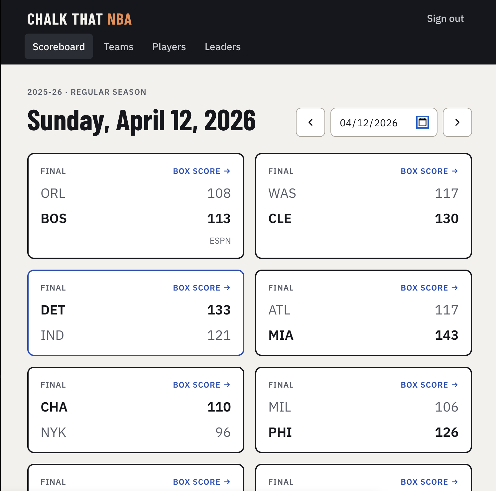
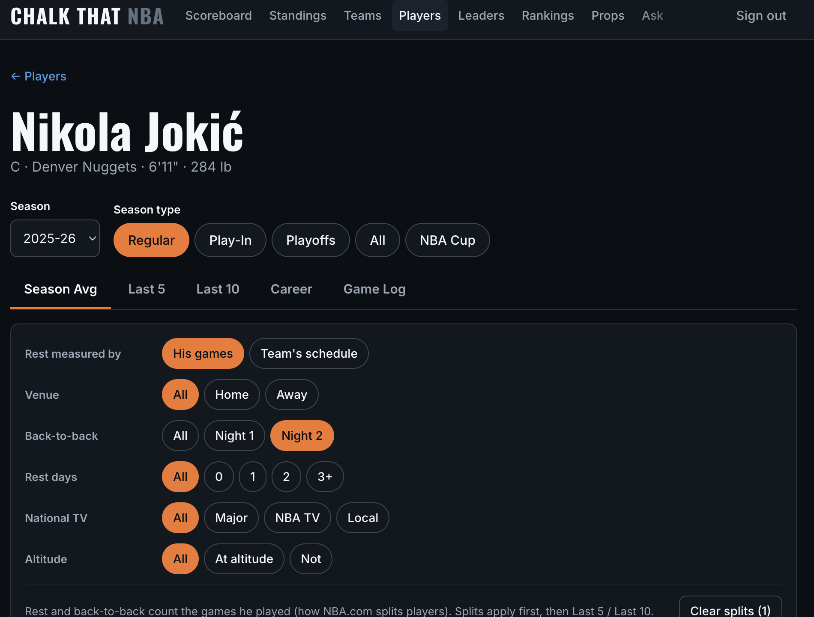
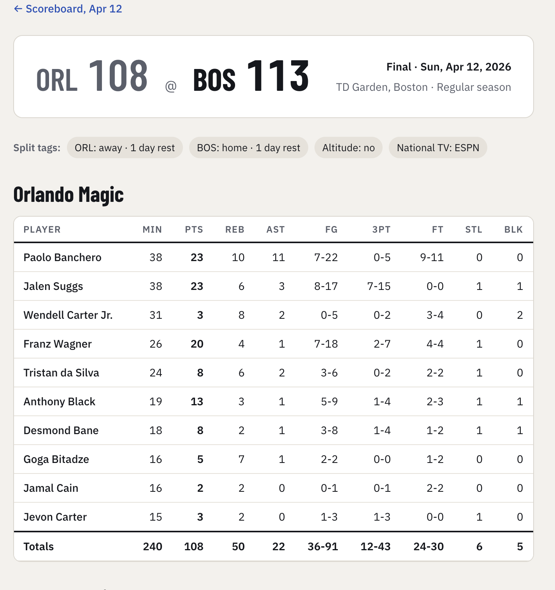
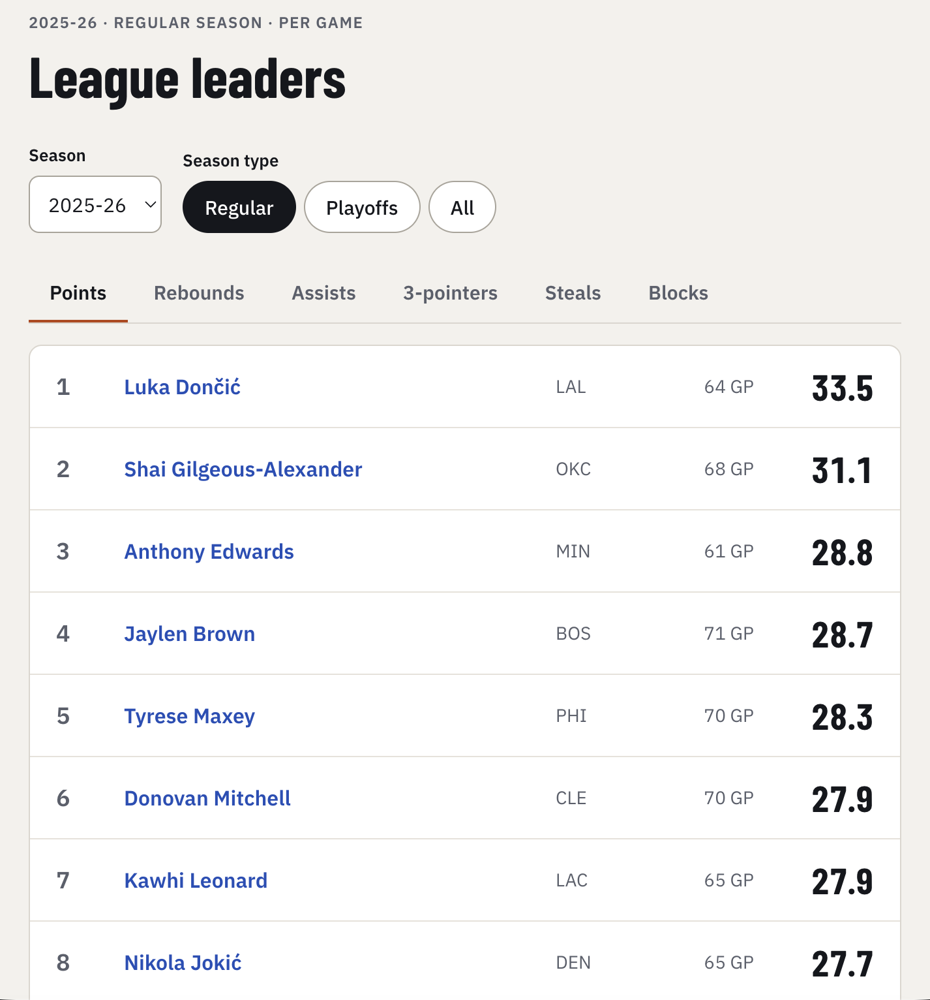
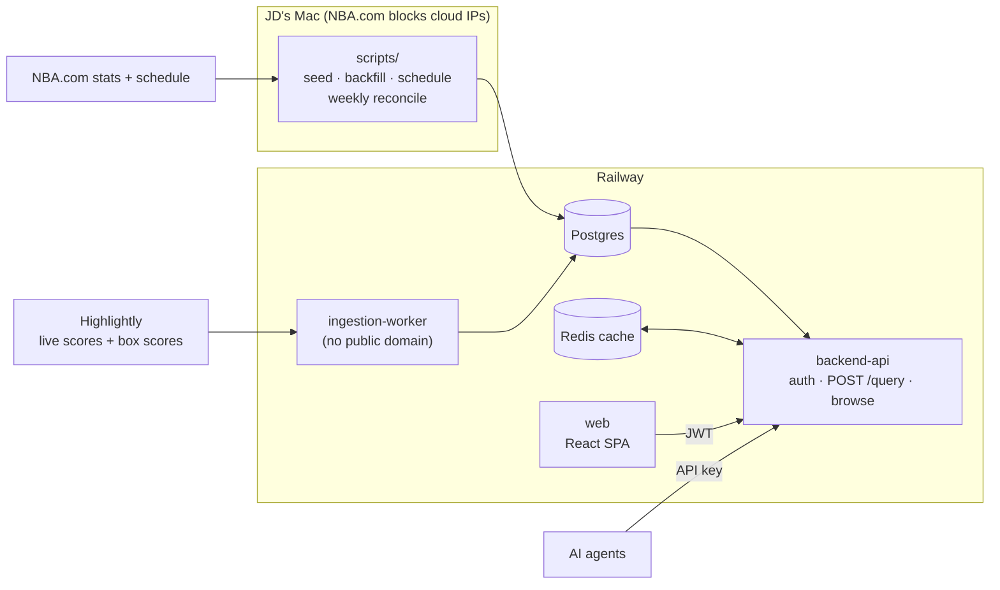

# Chalk That NBA

**Split-based NBA stats research: how does a player or team actually perform on the second night of a back-to-back, on national TV, at altitude, or with two days of rest?** Every number comes from real box scores and is checked against NBA.com. Nothing is predicted or modeled.

**Live:** https://web-production-081bcf.up.railway.app (invite-only sign-in)

The second app on the Chalk That platform, after [Chalk That NFL](https://github.com/Jayprox/ai-application-nfl). Both follow the same sport-agnostic playbook in [`PLATFORM.md`](PLATFORM.md).

| Scoreboard | Player detail with splits |
|---|---|
|  |  |
| **Box score + split tags** | **League leaders** |
|  |  |

---

## What it does

- **Every game since 2003-04:** ~30,900 games and ~620,000 player box-score rows, including every current player's full career. The current season updates live during games.
- **Splits written onto each game when it's loaded,** so filtering is a `WHERE` clause, not a calculation:
  - home / away / neutral site (international games, the 2020 bubble, Las Vegas)
  - days of rest (0 / 1 / 2 / 3+) and back-to-back night 1 or 2
  - national TV tier (major / NBA TV / local)
  - altitude (Denver, Utah, Mexico City)
- **Rest two ways:** measured from the player's own games (NBA.com's definition, so a player back from injury is rested) or from the team's schedule.
- **Scopes:** season average, last 5, last 10, career, game log. Splits apply before the window, so *Last 10 + Away* means his last 10 road games.
- **Leaderboards** with a stated qualifier: played in 70% of team games.
- **Rankings:** players by position (G/F/C) on an equal-weight z-score of eight stats, with every piece shown; team offense/defense/net ratings and pace ranked 1-30; and what each defense allows to guards, forwards and centers, which also appears next to every prop line and on team pages.
- **Player props:** DraftKings lines (The Odds API), pulled the morning of each game and again just before tip. A Props board shows each line with how often the player went over it in his last 10 and this season, and the result once the game ends. Player pages grade his next lines under any split: *over 25.5 in 7 of his last 10 road games*. Counts, not picks.
- **Standings and playoff bracket** for every season: records computed live from games, ranked by NBA.com's official standings (tiebreakers included).
- **Efficiency stats:** TS%, eFG%, free-throw rate and per-36 numbers for players; offensive/defensive rating for teams.
- **NBA Cup** as its own season type (2023-24 on).
- **One query API** (`POST /query`) serves the web app today and AI agents tomorrow (API-key auth).

### Verified against NBA.com

The test suite pins real published numbers, not hand-made fixtures:

| Check | Result |
|---|---|
| LeBron James 2003-04 | 79 GP, 20.9 PPG, 5.5 RPG, 5.9 APG |
| LeBron by days of rest (0 / 1 / 2 / 3+) | 20 / 40 / 12 / 7 games, same as NBA.com |
| Ja Morant 2019-20 by days of rest | 8 / 42 / 11 / 6 games, same as NBA.com |
| Nikola Jokić 2025-26 | 65 GP, 27.7 PPG |
| 2025-26 scoring leader | Luka Dončić, 33.5 PPG in 64 games |
| Every team's W-L, every season | Equals NBA.com standings (checked on every load) |
| TS% / eFG% (LeBron 2003-04, Morant 2019-20) | .488 / .438 and .556 / .509, same as NBA.com |

Matching the rest splits exactly meant learning NBA.com's own rules. A season opener's rest counts from the last preseason game. The 2020 bubble scrimmages count too. The 2007-08 Heat–Hawks game, replayed after the Shaq/Marion trade, puts Shawn Marion in two games on one date.

---

## Architecture



- **One shared query engine** for every client, with no predictive math.
- **Canonical IDs + a crosswalk table:** NBA.com and Highlightly ids map to one player/team/game. Adding a vendor is a data change, not a schema change.
- **Name matching that never guesses:** handles accents, `Jr.`/`III` and nicknames, but an ambiguous name goes to manual review instead of being merged. Two different Tim Hardaways exist.
- **Ingestion is its own service.** It only updates games the NBA.com schedule created, and NBA.com has the last word through a weekly reconcile.
- **Two-tier auth:** short-lived JWT plus rotating refresh tokens (a replayed token revokes every session) for people, API keys for agents.

Full decisions and trade-offs: [`docs/architecture.md`](docs/architecture.md). Build log and phase checklist: [`docs/vibe-coding-checklist.md`](docs/vibe-coding-checklist.md).

## Stack

| Piece | Choice |
|---|---|
| Backend | Node 22, Express, `pg`, Redis (optional cache), JWT + bcrypt |
| Frontend | React 19, Vite, Tailwind CSS v4, React Router 7 (plain JS) |
| Data | Postgres 18: 14 tables, CHECK constraints that reject impossible stat lines at write time |
| Ingestion | Standalone Node worker: Highlightly (scores, box scores) and The Odds API (props), planner-driven polling |
| Hosting | Railway: `backend-api`, `web`, `ingestion-worker`, Postgres, Redis |
| Tests | `node:test` (backend, worker, scripts) and Vitest + Testing Library (frontend): 133 tests |

## Repo layout

```
backend/    backend-api: auth, POST /query engine, browse routes      (Railway root: /backend)
frontend/   web app: 10 screens, shared StatExplorer, fetch hook        (Railway root: /frontend)
worker/     ingestion-worker: Highlightly scores + box scores          (Railway root: /worker)
scripts/    run from a Mac: schema, seed, backfill, schedule, status
db/         schema.sql, migrations/, constraint tests
docs/       architecture.md, vibe-coding-checklist.md
PLATFORM.md the cross-sport Chalk That playbook
```

Services don't share code (each has its own `package.json`). A few helpers, such as the name matching, are deliberately copied, and tests confirm the copies agree.

---

## Run it locally

Requires Node 22+ and a Postgres database (Railway's public URL works).

```bash
cp .env.example .env
npm install
npm run db:apply
npm run db:seed
npm run db:backfill -- --season 2025-26
npm run db:schedule
npm run db:standings

cd backend
npm install
DATABASE_URL="$(grep ^DATABASE_PUBLIC_URL= ../.env | cut -d= -f2-)" CT_PASSWORD='choose-a-strong-one' npm run create-user -- yourname
npm run dev

cd ../frontend
npm install
npm run dev
```

Fill in `DATABASE_PUBLIC_URL`, `HIGHLIGHTLY_API_KEY` and `ODDS_API_KEY` in `.env` before running the scripts. `npm run db:backfill` with no arguments loads all 23 seasons (about 10 minutes). The frontend runs on http://localhost:5173.

### Data operations

| When | Command (repo root unless noted) |
|---|---|
| Weekly during the season | `npm run db:weekly` (runs by itself Monday mornings via launchd, see `ops/launchd/`): schedule refresh + `db:backfill -- --season 2026-27` (NBA.com overwrites live data and reports any rows that differed) + `db:status` |
| Injury source check (preseason) | `cd worker && npm run injuries-probe -- --date 2026-10-03` |
| NBA changes the schedule (Cup knockouts, postponements) | `npm run db:schedule` |
| Official standings rank (also written by the backfill) | `npm run db:standings` |
| One-off live sync for a date | `cd worker && npm run sync -- --date 2026-10-21` |
| Health check | `npm run db:status`: row counts, failed runs, Highlightly quota, prop lines + Odds API credits, players waiting for review |
| Check the Odds API key (free) | `cd worker && npm run props -- --check` |
| Pull prop lines by hand | `cd worker && npm run props -- --date 2026-10-21 --snapshot close` |

### Tests

```bash
npm test
cd backend && TEST_DATABASE_URL=... npm test
cd worker && npm test
cd frontend && npm test
```

- **Repo root:** names, tagging and rest rules.
- **backend:** 55 tests, including the NBA.com number checks and prop grading.
- **worker:** mapping, polling planner and the props planner. Add `WORKER_TEST_DATABASE_URL` pointing at a local test database to also run the end-to-end sync.
- **frontend:** fetch-hook race conditions, token refresh, filter-to-query mapping.

---

## API in one example

```bash
curl -X POST https://backend-api-production-f05a.up.railway.app/query \
  -H "x-api-key: ctnba_..." -H "content-type: application/json" \
  -d '{"entity":"player","id":"<player uuid>","scope":"last10","season":"2025-26",
       "splits":{"venue":"away","player_rest":0}}'
```

Returns the averages plus `meta`: sample size, W-L in those games, the filters applied, notes (e.g. "neutral-site games are excluded from home/away") and data freshness.

## Known limitations

- **Stats begin in 2003-04.** Earlier careers (Kobe, Duncan, Dirk) are partial and the UI says so.
- **NBA.com blocks cloud IPs,** so the historical loads and the weekly reconcile run from a laptop.
- **Injuries aren't shown yet.** The source is still being evaluated against real preseason data.
- **Prop lines start with the 2026-27 regular season,** DraftKings only. There is no line history before that (a deliberate cost call), so older games show hit rates against today's line, not the line of the day.
- **The sign-in lockout is in memory:** one backend instance, and it resets on redeploy.
